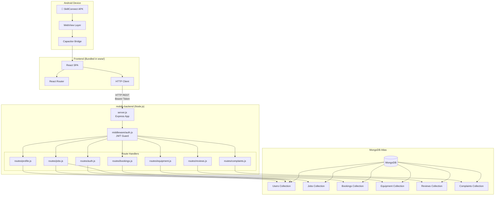
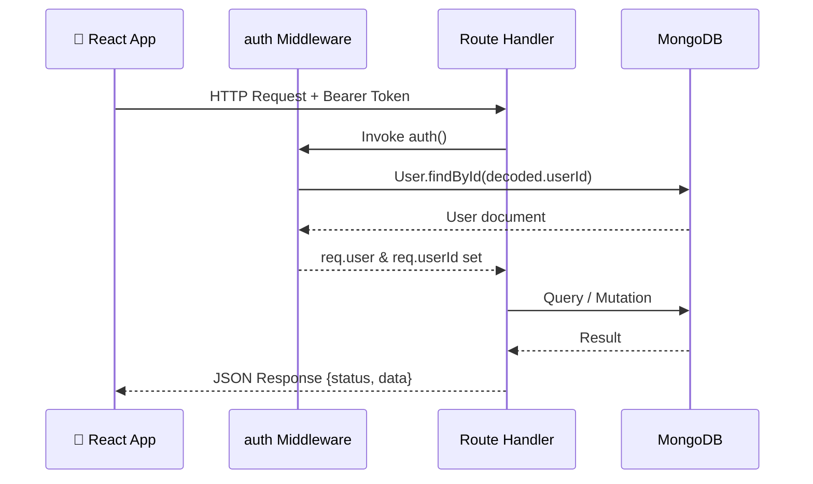
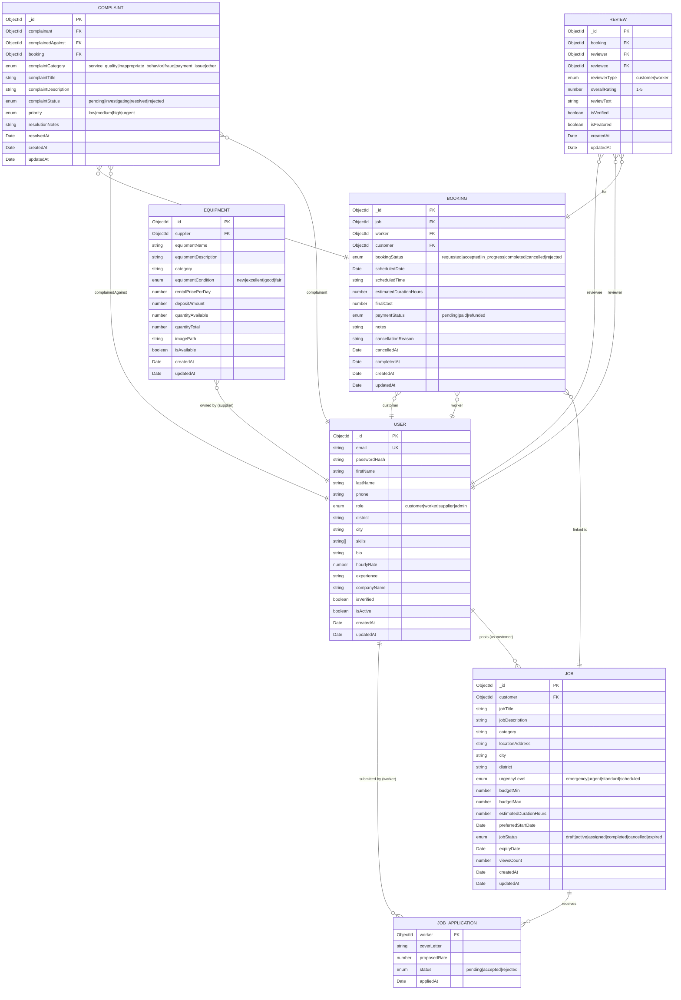
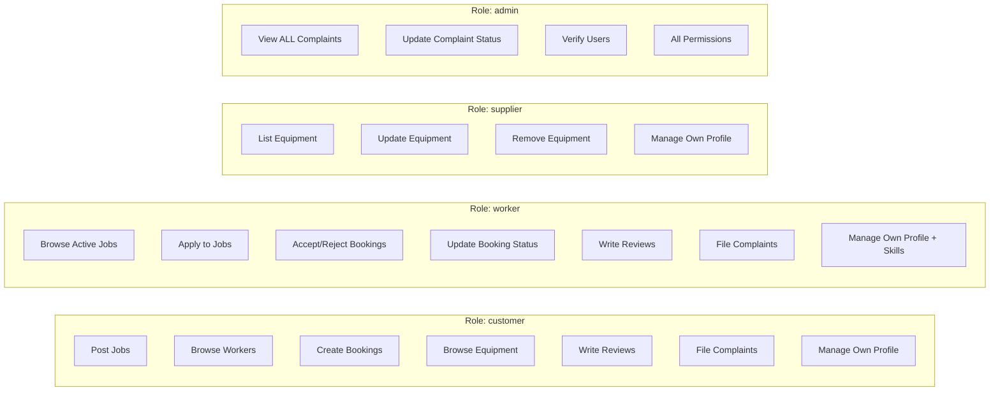
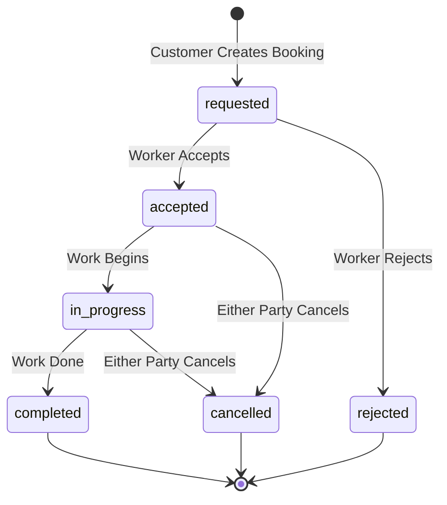
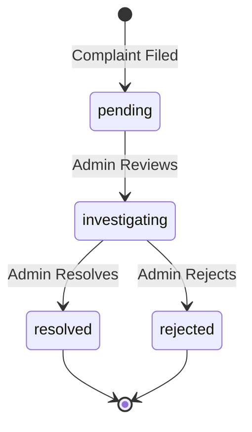
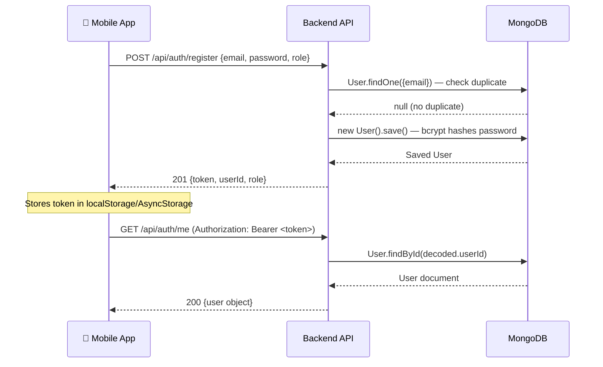
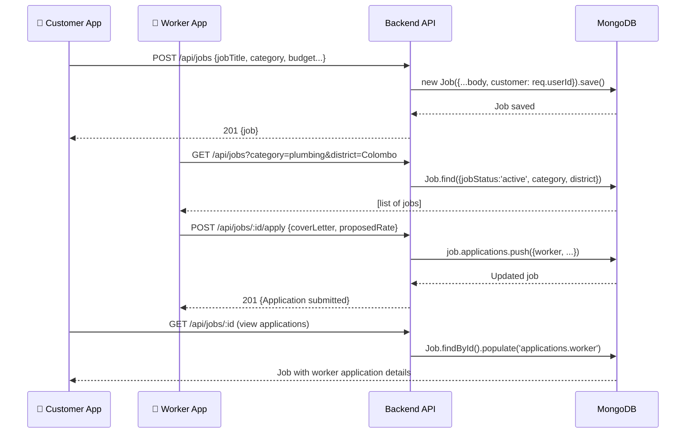
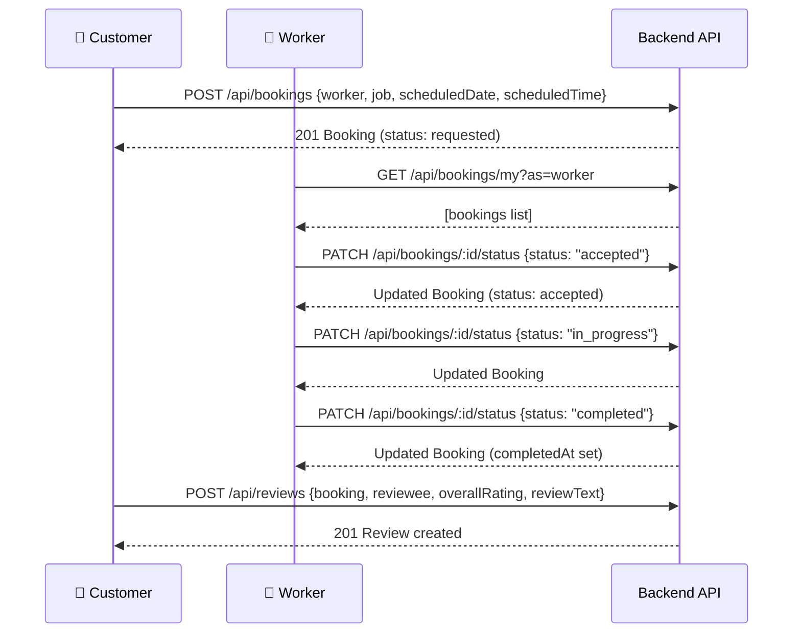
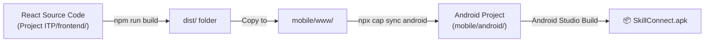

# SkillConnect Mobile — Complete Project Technical Report
> **Version:** 1.0 | **Date:** April 2026 | **Prepared by:** Engineering Team  
> **Audience:** New developers, technical leads, and stakeholders

---

## Table of Contents

1. [Project Overview](#1-project-overview)
2. [Technology Stack](#2-technology-stack)
3. [Repository Structure](#3-repository-structure)
4. [System Architecture](#4-system-architecture)
5. [Database Design (ERD)](#5-database-design-erd)
6. [User Roles & Permissions](#6-user-roles--permissions)
7. [API Reference](#7-api-reference)
8. [Key Workflows & Data Flow](#8-key-workflows--data-flow)
9. [Authentication & Security](#9-authentication--security)
10. [Mobile Shell (Capacitor)](#10-mobile-shell-capacitor)
11. [Environment Variables](#11-environment-variables)
12. [New Developer Onboarding](#12-new-developer-onboarding)
13. [Mobile SPA Architecture (www/)](#13-mobile-spa-architecture-www)
14. [Complete Screen Inventory](#14-complete-screen-inventory)

---

## 1. Project Overview

**SkillConnect** is a marketplace mobile application that connects:
- **Customers** who need skilled labour jobs done
- **Workers** (tradespeople, freelancers) who offer their skills for hire
- **Suppliers** who rent out tools and equipment
- **Admins** who manage the platform, resolve complaints, and verify users

The app is delivered as a native **Android APK** by wrapping a React web frontend inside a **Capacitor shell**. The backend is a standalone **Node.js REST API** backed by **MongoDB Atlas**.

### Core Features

| Feature | Description |
|---|---|
| Authentication | JWT-based register/login for all user roles |
| Job Marketplace | Customers post jobs; workers browse and apply |
| Booking System | Direct worker bookings with scheduling and status tracking |
| Equipment Rental | Suppliers list tools; customers browse and rent |
| Reviews | Post-booking star ratings from both parties |
| Complaints | Users file complaints; admins investigate and resolve |
| Profile Management | Role-specific profile fields with skill listings |

---

## 2. Technology Stack

### Backend (`mobile-backend/`)

| Layer | Technology | Version |
|---|---|---|
| Runtime | Node.js | 20+ |
| Framework | Express | ^4.18.2 |
| Database | MongoDB (via Mongoose) | ^8.0.0 |
| Authentication | JSON Web Token (JWT) | ^9.0.2 |
| Password Hashing | bcryptjs | ^2.4.3 |
| CORS | cors | ^2.8.5 |
| Config | dotenv | ^16.3.1 |
| Dev | nodemon | ^3.0.2 |

### Mobile Shell (`mobile/`)

| Layer | Technology | Version |
|---|---|---|
| Native Wrapper | Capacitor | ^8.2.0 |
| Target Platform | Android (via Android Studio) | Latest |
| Web Runtime | WebView (bundled www/) | — |

### Mobile Frontend (`mobile/www/`)

The mobile frontend is a **Vanilla JS Single-Page Application (SPA)** built directly into the Capacitor `www/` directory. It does **not** use React or a build step.

| Layer | Technology |
|---|---|
| Framework | Vanilla JS (no build step) |
| Routing | Custom hash-based SPA router (`app.js`) |
| HTTP Client | Native `fetch` API |
| Styling | Vanilla CSS (one file per screen) |
| Icons | RemixIcon CDN |
| Fonts | Google Fonts — Inter |

---

## 3. Repository Structure

```
SkillConnect-Mobile/
│
├── README.md
├── SkillConnect_Project_Report.md   # This document
│
├── mobile/                          # Capacitor Android shell
│   ├── capacitor.config.json
│   ├── package.json
│   ├── www/                         # ← Vanilla JS SPA (served by WebView)
│   │   ├── index.html               # Single HTML entry point, loads all CSS/JS
│   │   ├── css/                     # One CSS file per screen
│   │   │   ├── login.css
│   │   │   ├── register.css
│   │   │   ├── home.css
│   │   │   ├── my-profile.css
│   │   │   ├── edit-profile.css
│   │   │   ├── browse-workers.css
│   │   │   ├── worker-profile.css
│   │   │   ├── job-detail.css
│   │   │   ├── job-detail-worker.css
│   │   │   ├── browse-jobs.css
│   │   │   ├── booking-detail.css
│   │   │   ├── booking-detail-worker.css
│   │   │   ├── create-booking.css
│   │   │   ├── my-bookings.css
│   │   │   ├── my-bookings-worker.css
│   │   │   ├── my-applications-worker.css
│   │   │   ├── write-review.css
│   │   │   ├── write-review-worker.css
│   │   │   ├── create-complaint.css
│   │   │   ├── create-complaint-worker.css
│   │   │   ├── my-complaints.css
│   │   │   ├── my-complaints-worker.css
│   │   │   ├── browse-equipment.css
│   │   │   ├── equipment-detail.css
│   │   │   ├── my-equipment.css
│   │   │   ├── add-equipment.css
│   │   │   ├── edit-equipment.css
│   │   │   ├── equipment-detail-supplier.css
│   │   │   ├── all-complaints-admin.css
│   │   │   ├── complaint-detail-admin.css
│   │   │   ├── all-users-admin.css
│   │   │   └── user-detail-admin.css
│   │   └── js/                      # One JS file per screen
│   │       ├── app.js               # Router + navigate() + showToast()
│   │       ├── api.js               # All fetch() wrappers keyed by feature
│   │       ├── login.js
│   │       ├── register.js
│   │       ├── home.js
│   │       ├── my-profile.js
│   │       ├── edit-profile.js
│   │       ├── browse-workers.js
│   │       ├── worker-profile.js
│   │       ├── job-detail.js
│   │       ├── job-detail-worker.js
│   │       ├── browse-jobs.js
│   │       ├── post-job.js
│   │       ├── edit-job.js
│   │       ├── booking-detail.js
│   │       ├── booking-detail-worker.js
│   │       ├── create-booking.js
│   │       ├── my-bookings.js
│   │       ├── my-bookings-worker.js
│   │       ├── my-applications-worker.js
│   │       ├── write-review.js
│   │       ├── write-review-worker.js
│   │       ├── create-complaint.js
│   │       ├── create-complaint-worker.js
│   │       ├── my-complaints.js
│   │       ├── my-complaints-worker.js
│   │       ├── browse-equipment.js
│   │       ├── equipment-detail.js
│   │       ├── my-equipment.js
│   │       ├── add-equipment.js
│   │       ├── edit-equipment.js
│   │       ├── equipment-detail-supplier.js
│   │       ├── all-complaints-admin.js
│   │       ├── complaint-detail-admin.js
│   │       ├── all-users-admin.js
│   │       └── user-detail-admin.js
│   └── android/                     # Native Android Studio project
│       └── app/src/main/
│
└── mobile-backend/                  # Node.js REST API
    ├── server.js
    ├── package.json
    ├── .env
    ├── middleware/
    │   └── auth.js
    ├── models/
    │   ├── User.js
    │   ├── Job.js
    │   ├── Booking.js
    │   ├── Equipment.js
    │   ├── Review.js
    │   └── Complaint.js
    └── routes/
        ├── auth.js
        ├── jobs.js
        ├── bookings.js
        ├── equipment.js
        ├── reviews.js
        ├── complaints.js
        └── profile.js
```

---

## 4. System Architecture

### High-Level Architecture



### Request Lifecycle



---

## 5. Database Design (ERD)



---

## 6. User Roles & Permissions



| Field | customer | worker | supplier | admin |
|---|---|---|---|---|
| `role` value | `customer` | `worker` | `supplier` | `admin` |
| Post jobs | ✅ | ❌ | ❌ | ✅ |
| Apply to jobs | ❌ | ✅ | ❌ | ✅ |
| List equipment | ❌ | ❌ | ✅ | ✅ |
| Create bookings | ✅ | ❌ | ❌ | ✅ |
| View all complaints | ❌ | ❌ | ❌ | ✅ |
| Resolve complaints | ❌ | ❌ | ❌ | ✅ |
| `skills` field | Optional | ✅ Used | ❌ | — |
| `companyName` field | ❌ | ❌ | ✅ Used | — |
| `hourlyRate` field | ❌ | ✅ Used | ❌ | — |

---

## 7. API Reference

> **Base URL:** `http://<SERVER_IP>:5000`  
> **Auth:** All protected routes require `Authorization: Bearer <token>` header.

### 7.1 Auth — `/api/auth`

| Method | Endpoint | Auth | Description |
|---|---|---|---|
| `POST` | `/api/auth/register` | ❌ Public | Register new user (any role) |
| `POST` | `/api/auth/login` | ❌ Public | Login and receive JWT |
| `GET` | `/api/auth/me` | ✅ Required | Get current user from token |

**Register Body:**
```json
{
  "firstName": "John",
  "lastName": "Doe",
  "email": "john@example.com",
  "password": "secret123",
  "phone": "0771234567",
  "role": "worker"
}
```

**Login Response:**
```json
{
  "status": "success",
  "data": {
    "token": "<JWT>",
    "userId": "<ObjectId>",
    "name": "John Doe",
    "email": "john@example.com",
    "role": "worker"
  }
}
```

> Token expires after **7 days**.

---

### 7.2 Jobs — `/api/jobs`

| Method | Endpoint | Auth | Description |
|---|---|---|---|
| `GET` | `/api/jobs` | ✅ | List active jobs (filter: `?category=&district=&status=`) |
| `GET` | `/api/jobs/my` | ✅ | Get jobs posted by me |
| `GET` | `/api/jobs/:id` | ✅ | Get job detail + applications (increments viewCount) |
| `POST` | `/api/jobs` | ✅ | Create a new job posting |
| `PUT` | `/api/jobs/:id` | ✅ | Update own job |
| `DELETE` | `/api/jobs/:id` | ✅ | Delete own job |
| `POST` | `/api/jobs/:id/apply` | ✅ | Worker applies to job (with coverLetter, proposedRate) |

---

### 7.3 Bookings — `/api/bookings`

| Method | Endpoint | Auth | Description |
|---|---|---|---|
| `GET` | `/api/bookings/my` | ✅ | Get my bookings (`?as=customer` or `?as=worker`) |
| `GET` | `/api/bookings/:id` | ✅ | Get single booking detail |
| `POST` | `/api/bookings` | ✅ | Create booking (customer only) |
| `PATCH` | `/api/bookings/:id/status` | ✅ | Update booking status + optional reason |
| `DELETE` | `/api/bookings/:id` | ✅ | Delete booking (customer only) |

**Booking Status Flow:**



---

### 7.4 Equipment — `/api/equipment`

| Method | Endpoint | Auth | Description |
|---|---|---|---|
| `GET` | `/api/equipment` | ✅ | List all available equipment |
| `GET` | `/api/equipment/:id` | ✅ | Get single equipment item detail |
| `POST` | `/api/equipment` | ✅ | Supplier adds new equipment |
| `PUT` | `/api/equipment/:id` | ✅ | Supplier updates own equipment |
| `DELETE` | `/api/equipment/:id` | ✅ | Supplier deletes own equipment |

---

### 7.5 Reviews — `/api/reviews`

| Method | Endpoint | Auth | Description |
|---|---|---|---|
| `GET` | `/api/reviews` | ✅ | List all reviews |
| `GET` | `/api/reviews/my` | ✅ | Get reviews I have written |
| `POST` | `/api/reviews` | ✅ | Submit a review (linked to a booking) |
| `PUT` | `/api/reviews/:id` | ✅ | Update own review |
| `DELETE` | `/api/reviews/:id` | ✅ | Delete own review |

---

### 7.6 Complaints — `/api/complaints`

| Method | Endpoint | Auth | Description |
|---|---|---|---|
| `GET` | `/api/complaints` | ✅ | All complaints (admin sees all; others see own) |
| `GET` | `/api/complaints/my` | ✅ | Get my submitted complaints |
| `POST` | `/api/complaints` | ✅ | Submit a complaint |
| `PATCH` | `/api/complaints/:id/status` | ✅ Admin | Update status + resolutionNotes |
| `DELETE` | `/api/complaints/:id` | ✅ | Delete own complaint |

**Complaint Status Flow:**



---

### 7.7 Profile — `/api/profile`

| Method | Endpoint | Auth | Description |
|---|---|---|---|
| `GET` | `/api/profile/me` | ✅ | Get my full profile |
| `PUT` | `/api/profile/me` | ✅ | Update my profile (allowed fields only) |
| `GET` | `/api/profile/workers` | ✅ | List all active workers (`?district=`) |
| `GET` | `/api/profile/workers/:id` | ✅ | Get a specific worker's public profile |

**Updatable Profile Fields:**  
`firstName`, `lastName`, `phone`, `district`, `city`, `skills`, `bio`, `hourlyRate`, `experience`, `companyName`

---

## 8. Key Workflows & Data Flow

### 8.1 User Registration & Login Flow



### 8.2 Job Posting & Application Flow



### 8.3 Booking Lifecycle Flow



---

## 9. Authentication & Security

### JWT Middleware (`middleware/auth.js`)

Every protected route passes through the `auth` middleware:

```
Request → Check Authorization header → Extract Bearer token
      → jwt.verify(token, JWT_SECRET) → User.findById()
      → Validate isActive → set req.user & req.userId → next()
```

- Token payload: `{ userId, role }`
- Token TTL: **7 days**
- Tokens are **stateless** — no server-side session storage
- Password stored as **bcrypt hash** (12 salt rounds)
- `toJSON()` override on User model **strips `passwordHash`** from all API responses

> [!WARNING]
> The current implementation does **not** enforce role-based access control (RBAC) at the middleware level for most routes. Role checks (e.g., supplier-only for equipment, admin-only for complaint resolution) are implemented *inline* within route handlers. Future improvement: centralize RBAC middleware.

---

## 10. Mobile Shell (Capacitor)

### Configuration (`mobile/capacitor.config.json`)

```json
{
  "appId": "com.skillconnect.app",
  "appName": "SkillConnect",
  "webDir": "www",
  "bundledWebRuntime": false
}
```

### Build Pipeline



### Step-by-Step Build

```bash
# Step 1: Build the React frontend
cd "Project ITP/frontend"
npm run build

# Step 2: Copy the build to the mobile www/ folder (PowerShell)
Copy-Item -Recurse -Force "dist\*" "..\..\SkillConnect-Mobile\mobile\www\"

# Step 3: Sync and open in Android Studio
cd ..\..\SkillConnect-Mobile\mobile
npx cap sync android
npx cap open android

# Step 4: In Android Studio → Build → Build Bundle(s)/APK(s) → Build APK(s)
```

> [!IMPORTANT]
> For real device testing, set `VITE_API_BASE_URL=http://<LAN_IP>:5000/api` in the frontend `.env`.  
> **Never use `localhost`** — an Android device cannot reach your PC's localhost.

---

## 11. Environment Variables

### `mobile-backend/.env`

```env
# MongoDB Connection String (MongoDB Atlas or local)
MONGODB_URI=mongodb+srv://<username>:<password>@<cluster>.mongodb.net/<dbname>

# JWT Secret — use a long random string in production
JWT_SECRET=your_super_secret_jwt_key_here

# Server Port (default: 5000)
PORT=5000
```

> [!CAUTION]
> Never commit `.env` to version control. Add it to `.gitignore` immediately.

---

## 12. New Developer Onboarding

### Prerequisites

- [ ] Node.js 20+ installed
- [ ] Android Studio (latest) installed with Android SDK
- [ ] MongoDB Atlas account (or local MongoDB)
- [ ] Git access to this repository

### Setup Steps

```bash
# 1. Clone the repository
git clone <repo-url>
cd SkillConnect-Mobile

# 2. Set up the backend
cd mobile-backend
npm install

# 3. Create your .env file
cp .env.example .env     # (or create .env manually — see Section 11)
# → Fill in MONGODB_URI and JWT_SECRET

# 4. Start the backend in development mode
npm run dev
# → Should print: "Connected to MongoDB" + "Mobile backend running on http://localhost:5000"

# 5. Test the health endpoint
curl http://localhost:5000/api/health
# → {"status":"ok","message":"SkillConnect Mobile API running"}
```

### Codebase Navigation Guide

| I want to... | Go to... |
|---|---|
| Add a new API endpoint | `routes/<feature>.js` |
| Change a database schema | `models/<Model>.js` |
| Change auth logic | `middleware/auth.js` |
| Register a new route | `server.js` (add `app.use(...)`) |
| Understand data relationships | Section 5 (ERD) above |
| Build the APK | Section 10 above |
| Change app ID or name | `mobile/capacitor.config.json` |

### API Response Convention

All API responses follow this standard envelope:

```json
{
  "status": "success",
  "data": { ... }          // Single object OR { content: [...] } for lists
}
```

Error responses:
```json
{
  "message": "Human-readable error description",
  "error": "Technical error details (dev only)"
}
```

### Running Tests

> Currently, there are **no automated test suites** in this repository.  
> Manual API testing can be done via:
> - **Postman** — Import the endpoints from Section 7 above
> - **curl** — Use the health endpoint as a smoke test
> - **Frontend app** — Run the React dev server against local backend

---

## 13. Mobile SPA Architecture (www/)

The mobile frontend is a **Vanilla JS SPA** running inside the Capacitor WebView. There is no build step — files are served directly.

### Routing (`app.js`)

`app.js` is the SPA shell. It implements a custom client-side router:

```javascript
// Core pattern:
function renderPage(path, params, state) {
    switch(path) {
        case '/login':  renderLogin(app); break;
        case '/worker/bookings/:id': renderBookingDetailWorker(app, state); break;
        // ... one case per route
    }
}

function navigate(pathOrDelta, state = {}) {
    if (typeof pathOrDelta === 'number') return history.go(pathOrDelta);
    history.pushState({ path, params, state }, '', path);
    renderPage(path, params, state);
}
```

### Page Rendering Pattern

Each screen follows a consistent pattern:

```javascript
async function renderMyScreen(appElement, routeState) {
    // 1. Auth/role guard
    const token = localStorage.getItem('token');
    if (!token) return navigate('/login');

    // 2. Local state object (replaces useState)
    let s = { isLoading: true, data: null, ... };

    // 3. Pure render function (replaces React render)
    function updateUI() {
        appElement.innerHTML = buildHTML(s);
        // Re-attach DOM refs after innerHTML replacement
    }

    // 4. Single delegated event listener (replaces onClick handlers)
    appElement.addEventListener('click', e => {
        if (e.target.closest('#btn-back')) return navigate(-1);
        // ...
    });

    // 5. Async data fetch
    async function loadData() {
        const res = await api.getSomething();
        s.data = res.data;
        s.isLoading = false;
        updateUI();
    }

    updateUI(); // Show skeleton
    loadData();
}
```

### API Layer (`api.js`)

All `fetch()` calls are centralized in `api.js`:

```javascript
const BASE = import.meta?.env?.VITE_API_BASE_URL
    || window.APP_API_BASE_URL
    || 'http://localhost:5000';

const headers = () => ({
    'Content-Type': 'application/json',
    'Authorization': `Bearer ${localStorage.getItem('token')}`
});

const api = {
    login: (body) => fetch(`${BASE}/api/auth/login`, { method:'POST', ... }),
    getWorkers: () => fetch(`${BASE}/api/profile/workers`, { headers: headers() }),
    updateBookingStatus: (id, body) => fetch(...),
    // ... one method per API call
};
```

### localStorage Keys

| Key | Type | Description |
|---|---|---|
| `token` | string | JWT Bearer token |
| `userId` | string | Authenticated user's `_id` |
| `role` | string | `customer` \| `worker` \| `supplier` \| `admin` |
| `name` | string | Full name for display |

### Design System Conventions

- **Tap targets:** Minimum `48px` height on all interactive elements
- **Safe area:** All screens use `env(safe-area-inset-top)` and `env(safe-area-inset-bottom)`
- **Color coding by role:**
  - Customer → Amber (`#D97706`)
  - Worker → Teal (`#0D9488`)
  - Supplier → Blue (`#2563EB`)
  - Admin → Purple/brand-primary
- **Skeleton loading:** `opacity: 1 → 0.4 → 1` pulse on `#E5E7EB` placeholder blocks
- **Toast system:** Global `showToast(message, type)` function in `app.js`
- **Bottom sheets:** Slide-up overlays with backdrop for confirmations and filters

---

## 14. Complete Screen Inventory

### Customer Role

| Screen | Route | JS File | Description |
|---|---|---|---|
| Login | `/login` | `login.js` | JWT login with validation |
| Register | `/register` | `register.js` | Role-based registration |
| Home / Dashboard | `/home` | `home.js` | Role-aware dashboard |
| My Profile | `/profile` | `my-profile.js` | View own profile |
| Edit Profile | `/profile/edit` | `edit-profile.js` | Update profile fields |
| Browse Workers | `/workers` | `browse-workers.js` | Search/filter worker listings |
| Worker Profile | `/workers/:id` | `worker-profile.js` | Public worker profile |
| Browse Jobs | `/jobs` | `browse-jobs.js` | Active job listings (customer) |
| Job Detail | `/jobs/:id` | `job-detail.js` | Full job + application management |
| Post Job | `/jobs/create` | `post-job.js` | Create new job posting |
| Edit Job | `/jobs/:id/edit` | `edit-job.js` | Edit existing job |
| Create Booking | `/bookings/create` | `create-booking.js` | Book a worker |
| My Bookings | `/customer/bookings` | `my-bookings.js` | List own bookings |
| Booking Detail | `/customer/bookings/:id` | `booking-detail.js` | Full booking + cancel flow |
| Write Review | `/reviews/create` | `write-review.js` | Rate worker post-booking |
| File Complaint | `/complaints/create` | `create-complaint.js` | Submit complaint against worker |
| My Complaints | `/customer/complaints` | `my-complaints.js` | View/withdraw own complaints |
| Browse Equipment | `/equipment` | `browse-equipment.js` | Browse rental equipment |
| Equipment Detail | `/equipment/:id` | `equipment-detail.js` | View equipment listing |

### Worker Role

| Screen | Route | JS File | Description |
|---|---|---|---|
| Browse Jobs | `/worker/jobs` | `browse-jobs.js` (shared) | Browse available jobs |
| Job Detail | `/worker/jobs/:id` | `job-detail-worker.js` | Job detail + apply |
| My Applications | `/worker/applications` | `my-applications-worker.js` | View own applications |
| My Bookings | `/worker/bookings` | `my-bookings-worker.js` | Incoming booking requests |
| Booking Detail | `/worker/bookings/:id` | `booking-detail-worker.js` | Accept/reject, status updates |
| Write Review | `/worker/reviews/create` | `write-review-worker.js` | Rate customer post-booking |
| File Complaint | `/worker/complaints/create` | `create-complaint-worker.js` | Submit complaint vs customer |
| My Complaints | `/worker/complaints` | `my-complaints-worker.js` | View/withdraw own complaints |

### Supplier Role

| Screen | Route | JS File | Description |
|---|---|---|---|
| My Equipment | `/supplier/equipment` | `my-equipment.js` | Manage own equipment listings |
| Add Equipment | `/supplier/equipment/add` | `add-equipment.js` | Create new listing |
| Edit Equipment | `/supplier/equipment/:id/edit` | `edit-equipment.js` | Update listing fields |
| Equipment Detail (Own) | `/supplier/equipment/:id` | `equipment-detail-supplier.js` | Performance stats + stock controls |

### Admin Role

| Screen | Route | JS File | Description |
|---|---|---|---|
| All Complaints | `/admin/complaints` | `all-complaints-admin.js` | Platform-wide complaint dashboard |
| Complaint Detail | `/admin/complaints/:id` | `complaint-detail-admin.js` | Investigate + resolve/reject |
| All Users | `/admin/users` | `all-users-admin.js` | List all workers + verify inline |
| User Detail | `/admin/users/:id` | `user-detail-admin.js` | Full profile + moderation actions |

### Screen Count Summary

| Role | Screen Count |
|---|---|
| Customer | 19 |
| Worker | 8 |
| Supplier | 4 |
| Admin | 4 |
| **Total** | **35** |

> Shared screens (profile, home, login, register) serve multiple roles via conditional rendering.

---

*End of Report — SkillConnect Engineering Team, April 2026 (Updated)*
